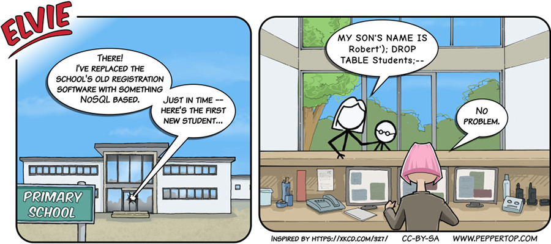

Elvie #033
==========
This strip appeared in issue #193 of Linux (Pro) Magazine. Whilst creating this strip we were unaware that
Linux Voice was being absorbed into Linux (Pro) Magazine. Fortunately the article that this strip was designed
to accompany - on "NoSQL" databases - was still included in the Linux Voice section of the magazine.

This cartoon was inspired by, and is intended as a parody of, an XKCD comic strip:

https://xkcd.com/327/

The original strip suggests how destructive a well-crafted SQL injection attack can be; our cartoon takes that
premise and turns it around to imply that the original attack is useless against a NoSQL-based system.

File Details
------------
* 033_panel_n.ora     - The original MyPaint image used for panel "n".
* 033_panel_n.png     - A PNG image, exported from an ORA file using The GIMP, for the main drawing in panel "n".
* Elvie_033.svg       - The Inkscape SVG file that combines the panel images with frames and text to create the comic.
* Elvie_033_en-GB.jpg - A PNG export of the final Inkscape file, converted to JPEG format for use on our website (British English).

In addition this strip uses an additional font, "Comic Neue Bold", which can be found in the "resources"
directory at the root of this repository. This font was used to ensure that the speech bubble of the
mother more closely resembled that of the original XKCD comic. The Comic Neue font family is under an
SIL Open Font License, and can be downloaded from the following website:

http://comicneue.com/

