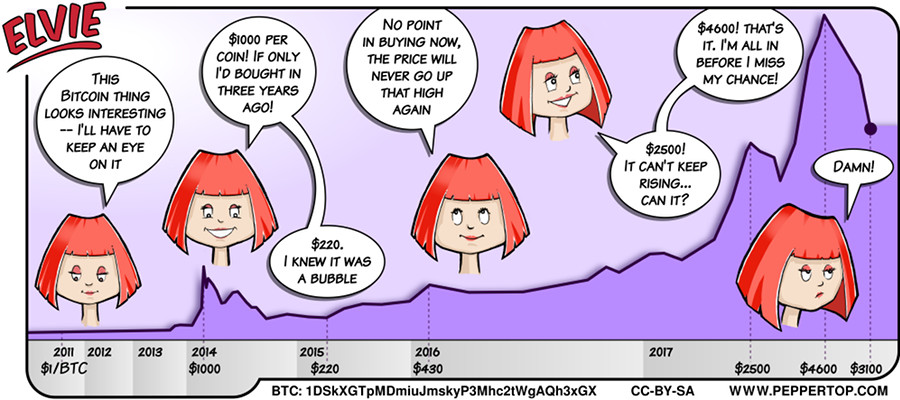

Elvie #046
==========

This strip appeared in issue #206 of Linux (Pro) Magazine, in December 2017.

At the time that this strip was created, Bitcoin had reached a peak of $4,600 then dropped down to $3,100. We didn't predict the $20k price it would reach in late December 2017, nor the plummeting drop that would follow - otherwise we would have created this comic a few weeks later than we did! At least if Elvie held on to her money, rather than panic selling, it should still be worth more than she paid for it, even now (November 2018).

(Oh, and if you feel like dropping a few satoshis our way, the address on the strip is: **1DSkXGTpMDmiuJmskyP3Mhc2tWgAQh3xGX** - or use the QR code below)

File Details
------------
* Elvie_heads.ora     - The original MyPaint image of several heads in a single document.
* Elvie_head_n.png    - A PNG image, exported from the ORA file using The GIMP. One for each head (though #5 isn't actually used in this strip).
* Elvie_046.svg       - The Inkscape SVG file that combines the panel images with frames and text to create the comic.
* Elvie_046_en-GB.jpg - A PNG export of the final Inkscape file, converted to JPEG format for use on our website (British English).

