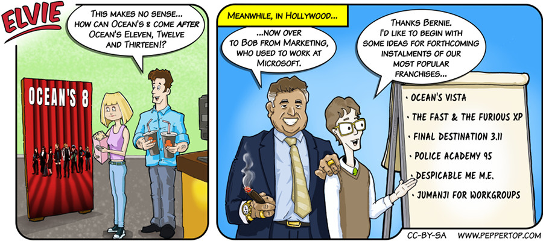

Elvie #054
==========
This strip appeared in issue #214 of Linux (Pro) Magazine in early 2018, shortly after the release of the film "Ocean's 8",
and is a satirical reference to Microsoft's tendency to jump around the number line when naming their Windows and XBox products.

File Details
------------
* 054_panel_n.ora     - The original MyPaint image used for panel "n".
* 054_panel_n.png     - A PNG image, exported from an ORA file using The GIMP, for the main drawing in panel "n".
* Elvie_054.svg       - The Inkscape SVG file that combines the panel images with frames and text to create the comic.
* Elvie_054_en-GB.jpg - A PNG export of the final Inkscape file, converted to JPEG format for use on our website (British English).

In addition this strip uses two extra fonts, "Anton", and "Kalam Bold", which can be found in the "resources"
directory at the root of this repository.

Originally the title at the top of the "Ocean's 8" cinema poster was set in "Impact", downloadable as part
of Microsoft's Core Fonts for the Web (https://en.wikipedia.org/wiki/Core_fonts_for_the_Web). The version of this
strip that appeared in Linux (Pro) Magazine used this font. In an effort to make the strip as Free as possible,
the version in this repo has replaced "Impact" with "Anton". This is under a SIL Open Font License, and can be 
downloaded from the following website:

https://github.com/vernnobile/AntonFont

"Kalam Bold" was used to give Bob's handwriting on the flip chart a different feel to the rest of the text 
in the strip. The Kalam font family is under a SIL Open Font License, and can be downloaded from the 
following website:

https://github.com/itfoundry/kalam

