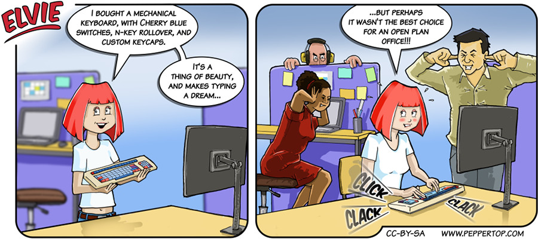

Elvie #055
==========
This strip first appeared in issue #215 of Linux (Pro) Magazine. This one was based on the true story of my
own 1984-vintage Cherry keyboard, rescued from a dumpster, cleaned and brought back into service - to the
annoyance of my colleagues at the time.

Because there was no such thing as a 'Windows' (aka 'Super') key back in 1984, I even ended up getting hold
of a small microcontroller on a USB-stick form factor, and programming it to send a suitable keypress when
a button on the board was pressed. It rarely got used, but just occasionally I would come across a piece of
software or functionality that would _only_ work with the Windows key, so the creation of this little dongle
allowed me to continue working with my lovely-to-type-on Cherry keyboard without any loss of modern
functionality.

File Details
------------
* 055_panel_n.ora     - The original MyPaint image used for panel "n".
* 055_panel_n.png     - A PNG image, exported from an ORA file using The GIMP, for the main drawing in panel "n".
* Elvie_055.svg       - The Inkscape SVG file that combines the panel images with frames and text to create the comic.
* Elvie_055_en-GB.jpg - A PNG export of the final Inkscape file, converted to JPEG format for use on our website (British English).

