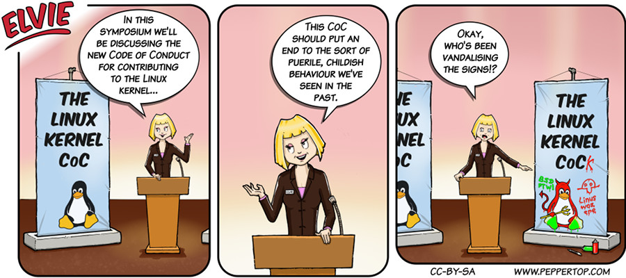

Elvie #059
==========
This strip first appeared in issue #219 of Linux (Pro) Magazine, shortly after a Code of Conduct was introduced for
contributors to the Linux kernel.

File Details
------------
* 059_panel_n.ora     - The original MyPaint image used for panel "n".
* 059_panel_n.png     - A PNG image, exported from an ORA file using The GIMP, for the main drawing in panel "n".
* Elvie_059.svg       - The Inkscape SVG file that combines the panel images with frames and text to create the comic.
* Elvie_059_en-GB.jpg - A PNG export of the final Inkscape file, converted to JPEG format for use on our website (British English).

