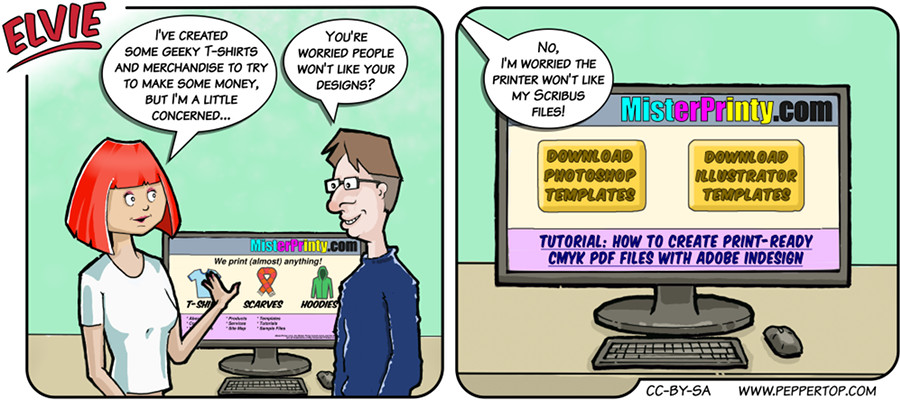

Elvie #068
==========
This strip first appeared in issue #228 of Linux (Pro) Magazine, and is inspired by the concerns of every artist or
designer who has ever used FOSS tools to create their work, but then have to send them to a bureau or print shop that
is tooled entirely around the "industry standard" Adobe products.

File Details
------------
* 068_panel_n.ora     - The original MyPaint image used for panel "n".
* 068_panel_n.png     - A PNG image, exported from an ORA file using The GIMP, for the main drawing in panel "n".
* Elvie_068.svg       - The Inkscape SVG file that combines the panel images with frames and text to create the comic.
* Elvie_068_en-GB.jpg - A PNG export of the final Inkscape file, converted to JPEG format for use on our website (British English).

