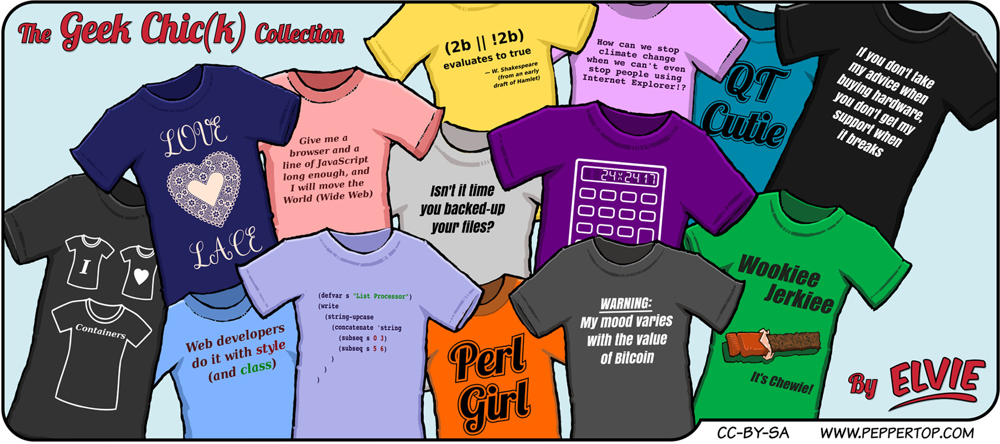

Elvie #069
==========
This strip first appeared in issue #229 of Linux (Pro) Magazine, and is the second in a trilogy of strips following
Elvie's efforts to make some money by selling some geeky merchandise. In a change from our usual panel layout and
style, this strip showcases some of her designs, rather than focusing on a single narrative joke.

File Details
------------
* 069_panel_1.ora     - The original MyPaint image used for the T-shirts.
* 069_panel_1.png     - A PNG image, exported from the ORA file using The GIMP.
* Elvie_069.svg       - The Inkscape SVG file that combines the t-shirt images, vector images and text to create the comic.
* Elvie_069_en-GB.jpg - A PNG export of the final Inkscape file, converted to JPEG format for use on our website (British English). Note that this image is double the resolution of our usual jpegs to allow for zooming to get a clearer view of the text.

