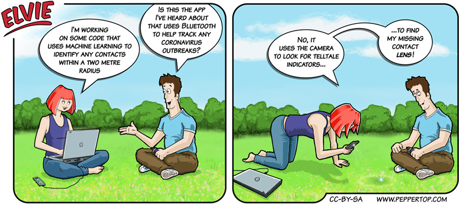

Elvie #077
==========
This strip first appeared in issue #237 of Linux (Pro) Magazine. It was created in mid-2020, at a time when the news was filled with talk of governments around the world creating apps that would use Bluetooth to track your exposure, in terms of proximity and duration, to people who  subsequently tested positive for covid-19. These were generally referred to as "contact tracing" apps.

File Details
------------
* 077_panel_n.ora     - The original MyPaint image used panel n in the strip.
* 077_panel_n.png     - A PNG image, exported from the ORA file for panel n using The GIMP.
* Elvie_077.svg       - The Inkscape SVG file that combines the panel images with frames and text to create the comic.
* Elvie_077_en-GB.jpg - A PNG export of the final Inkscape file, converted to JPEG format for use on our website (British English).

