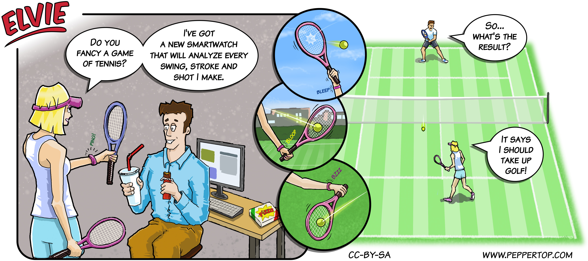

Elvie #078
==========
This strip first appeared in issue #238 of Linux (Pro) Magazine. It's the first of a pair of strips that are slightly related in their use of tennis as a subject matter. The second strip was written first, with this one subsequently created as a "lead-in".

File Details
------------
* 078_panel_n.ora     - The original MyPaint image used panel n in the strip.
* 078_panel_n.png     - A PNG image, exported from the ORA file for panel n using The GIMP.
* Elvie_078.svg       - The Inkscape SVG file that combines the panel images with frames and text to create the comic.
* Elvie_078_en-GB.jpg - A PNG export of the final Inkscape file, converted to JPEG format for use on our website (British English).

Note that the background and character images for the last panel were exported as separate files (078_panel_3_BG.png, 078_panel_3_Elvie.png and 078_panel_3_James.png) in order to allow them to be more easily positioned in the final composition.

