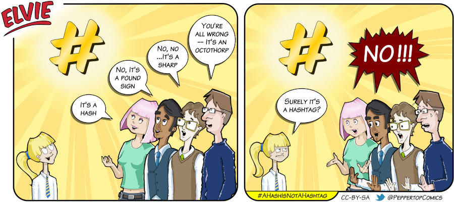

Elvie #084
==========
This strip first appeared in issue #244 of Linux (Pro) Magazine. It was inspired by the kids in the Code Club that I run. They're aged between 7 and 11, and universally believe that the '#' character is called 'a hashtag'. No amount of explanation or historical insight seems able to shift them from this viewpoint. I therefore predict that eventually the de facto name for this character will become 'hashtag', and all other names will be considered archaic.

File Details
------------
* 084_panel_n.ora     - The original MyPaint image used panel n in the strip.
* 084_panel_n.png     - A PNG image, exported from the ORA file for panel n using The GIMP.
* Elvie_084.svg       - The Inkscape SVG file that combines the panel images with frames and text to create the comic.
* Elvie_084_en-GB.jpg - A PNG export of the final Inkscape file, converted to JPEG format for use on our website (British English).

