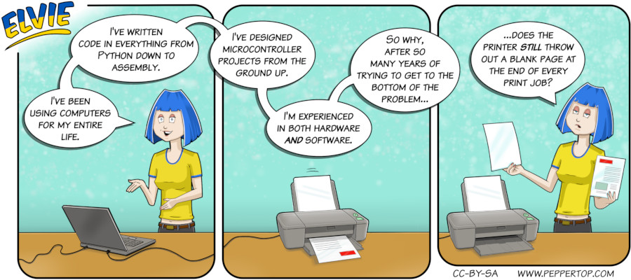

Elvie #099
==========
This strip first appeared in issue #259 of Linux (Pro) Magazine. This was shortly after Russia's invasion of Ukraine, so we chose to colour the logo, and Elvie's hair and T-shirt as a small gesture of solidarity with the Ukrainian people.

File Details
------------
* 099_panel_1_2.ora     - The original MyPaint image used for panels 1 & 2 in the strip.
* 099_panel_1_2.png     - A PNG image, exported from the ORA file for panels 1 & 2 using The GIMP.
* 099_panel_3.ora       - The original MyPaint image used for panel 3 in the strip.
* 099_panel_3.png       - A PNG image, exported from the ORA file for panel 3 using The GIMP.
* Elvie_099.svg       - The Inkscape SVG file that combines the panel images with frames and text to create the comic.
* Elvie_099_en-GB.jpg - A PNG export of the final Inkscape file, converted to JPEG format for use on our website (British English).

