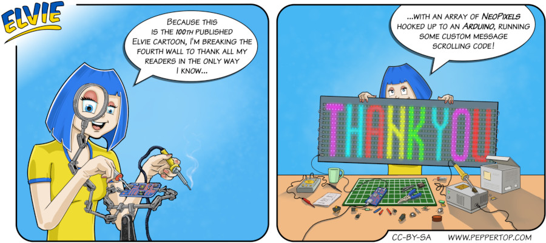

Elvie #100
==========
This strip first appeared in issue #260 of Linux (Pro) Magazine. The Elvie series was originally written for Linux Voice
magazine, which ran for 32 editions, from April 2014 to November 2016. It was subsequently merged into Linux (Pro) Magazine
as a regular section, featuring several of the Linux Voice contributors. Elvie also made this transition, and has continued
to be a monthly feature of the magazine. By the time issue #260 came out, in July 2022, Elvie strips had appeared in 68
issues of the magazine, for a total of 100 strips (not including a web-only prequel strip that can still be found on our
website). This strip was created to celebrate that milestone, and to thank not only our readers, but all the editors and
staff we have worked with at both magazines, for their support of our little techy comic heroine.

File Details
------------
* 100_panel_n.ora     - The original MyPaint image used for panel n in the strip.
* 100_panel_n.png     - A PNG image, exported from the ORA file for panel n using The GIMP.
* Elvie_100.svg       - The Inkscape SVG file that combines the panel images with frames and text to create the comic.
* Elvie_100_en-GB.jpg - A PNG export of the final Inkscape file, converted to JPEG format for use on our website (British English).

